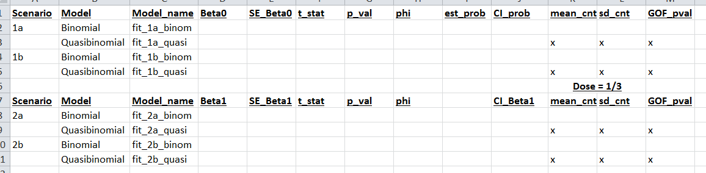

#Correlated Data {#ch-corrdata}
##Learning Objectives 
After finishing this chapter, you should be able to:

- Given a data structure, be able to recognize when there is a potential for correlation.
- Identify a primary sampling unit and corresponding observations for a study.
- Provide reasons why correlated observations may cause problems when modeling.
- Describe overdispersion and why it might occur.
- Understand how correlation in data can be taken into account using random effects models.
- Be able to describe the differences in the kind of inferences that can be made using fixed versus random effects models.
- Use software to fit a model taking correlation into account using:
    - overdispersion parameter estimates (quasi-likelihood) or
    - random effects.

Introductory statistics courses typically require responses which are approximately normal and independent of one another. We saw from the first chapters in this book that there are models for non-normal responses, so we have already broadened the types of applications we can handle. In this chapter, we relax an additional assumption from introductory statistics, that of independence.  Here we introduce methods that allow correlation to be taken into account. When modeling, correlation can be considered for normal and non-normal responses. Taken together, we can handle many more applications than the average introductory student.

First, we focus on recognizing data structures that may imply correlation. Next, we consider potential problems correlated outcomes may cause and why we need to take correlation into account when modeling. Models which take correlation into account are then described and fit with the help of R.

##Recognizing correlation
Correlated data is encountered in nearly every field. In education, student scores from a particular teacher are more similar than scores of other students who have had a different teacher. During a study measuring depression indices weekly over the course of a month, we may find that four measures for the same patient tend to be more similar than  depression indices from other patients. In political polling, opinions from members of the same household may be more similar than opinions of members from other randomly selected  households. The structure of these data sets suggest inherent patterns of similarities or correlation among outcomes. This kind of correlation specifically concerns correlation of observations *within the same teacher or patient or household* and is referred to as __intraclass correlation__.

To simplify our discussion, we borrow terminology from survey methodology. In our examples, teachers, patients, and households can be referred to as __primary sampling units__ or __PSUs__. 

> In sample surveys, primary sampling unit (commonly abbreviated as PSU) arises in samples in which population elements are grouped into aggregates and the aggregates become units in sample selection. The aggregates are, due to their intended usage, called "sampling units." Primary sampling unit refers to sampling units that are selected in the first (primary) stage of a multi-stage sample ultimately aimed at selecting individual elements.
>
> --- James M. Lepkowski, SAGE (2008)

A PSU is sampled and multiple measurements or observations are made for each PSU; here test scores, depression indices, and political opinions are the measurements, respectively. Other examples appear in the table below. Look for this structure when analyzing data.

\begin{table}[htdp]
\caption{Examples of data structures for studies with potential within PSU correlation. Elements of the PSUs with measurements to be made and type of measurement.}
\label{corrExamples.tab}
\begin{center}
\begin{tabular}{|l|p{3cm}|c|p{2cm}|p{2cm}|p{2cm}|}
\hline
Types of Data &Study & PSU & Elements& Response & Type of Response Variable*\\
\hline
\hline
Clustered Data & Four dams (pregnant rats) produce pups who have a defect or no defect. & Dam & Pups & No defect (0) or defect (1)& Binary\\
\hline
Repeated Measures &
Ten newborns' height is measured four times each.&
Newborn & Measurement Attempts & Height measurement & Normal\\
\hline
Longitudinal Data&
Twenty musicians record their level of anxiety for each of their performances throughout the season. &
Musician & Performances & Anxiety scores & Normal\\
\hline
\hline
Survey Data &
A random survey of county board members for 88 counties solicits their opinion on a tax referendum. &
County & County board members & Opinions & Ordinal\\
\hline
Spatial Data &
Particulate  measurements are made  at 25 locations within teen counties. &
County & Measurement location &Particulate measurements & Poisson \\
\hline
\end{tabular}
\end{center}
\label{CorrDataExamples}
\end{table}

Correlated data structures can also involve mixture models.  For example, in Section \@ref(cs:drinking) we saw the zero-inflated Poisson model, which is a mixture of binary and Poisson variables.  Another common mixture is when a population has two subgroups described by normal distributions with potentially different means and standard deviations.  We will explore methods for analyzing mixture models too.

##Case Study: Dams and pups, Correlated Binary Outcomes
A __tertogen__ is a substance or exposure that can result in harm to a developing fetus. An experiment can be conducted to determine whether increasing levels of a potential teratogen results in increasing probability of defects in rat pups. For example, consider an experiment in which dams (pregnant rats) are exposed to one of two dose levels of a potential teratogen. A control group is not exposed. Dams produce litters and the number of pups with a defect is the outcome of interest.

###Sources of Variability
In order to analyze the entire data set, let's step back and look at the big picture. Statistics is all about analyzing variability, so let's consider what sources of variability we have in the dams and pups example. There are several reasons why the counts of the number of defective pups differ from dam to dam and it is helpful to explicitly identify what they are in order to determine how the dose levels affect the pups in addition to accommodating correlation.

__Dose Effect__ The dams and pups experiment is being carried out to determine whether different dose levels affect the development of defects differently. Of particular interest is determining whether a **dose-response** effect is present. A dose-response effect is evident when dams receiving higher dose levels produce higher proportions of pups with defects. Knowing defect rates at specific dose levels is typically of interest within this experiment and beyond. Publishing the defect rates for each dose level in a paper in a journal, for example, would be of interest to other teratologists. For that reason, we refer to the dose level effects as __fixed effects__.

__Dams (Litter) Effect__  In many settings like this, there is a litter effect as well. For example, some dams may exhibit a propensity to produce pups with defects while others rarely produce litters with defective pups. That is, observations on pups within the same litter are likely to be similar or correlated. Unlike the dose effect, teratologists reading experiment results are not interested in the estimated probability of defect for each dam in the study, and we would not report these estimated probabilities in a paper. However, there may  be interest in the *variability* in litter-specific defect probabilities. Often this kind of effect is modeled using the idea that randomly selected dams produce __random effects__. This provides one way in which to model correlated data. We elaborate on this idea throughout the remainder of the text after this next section on overdispersion.

__Pup-to-pup variability__ The within litter pup-to-pup differences reflect random, unexplained variation in the model.

###Analyzing a control group
We begin by focusing on a control group, ignoring the dose group data. The control group for this study consists of four dams who each produce 15 rat pups in their litter. Each pup is examined for the presence or absence of a defect. (Dams typically produce 8 to 15 pups, so it is unlikely that every dam produces 15 pups. Here we keep it simple with fifteen pups per litter.) Before proceeding any further with the analysis, take note of the data structure. We can think of this  as a repeated measures study where dams are PSUs and the elements are the binary outcomes of defect or no defect for each pup. The total number of pups with a defect for a single dam is the response, which is binomial with n=15 and probability of defect $p$. This structure alerts us to the possibility that pup outcomes may be correlated within litters; thus, we may not have 60 independent observations, and we'll want to take that into account when modeling.

Each dam $j$ produces a litter of 15 pups (j=1, $\ldots$, 4). Individual pup outcomes are either  0 or 1 for "no defect" or "defect" and are denoted as $Y_{jk}$ for the $k^{th}$ pup from the $j^{th}$ dam, $k=1, \ldots, 15$ and $j=1, \ldots, 4$. The binomial counts, $Y_{j.}=\sum_{k=1}^{15}Y_{jk}$, the total number of defects for the $j^{th}$ litter, are recorded for each of the four litters. If dams do not differ in their propensity to produce defects, these counts follow a binomial distribution with n=15 and a common probability $p$. However, if dams' probabilities of producing a pup with a defect differ from dam-to-dam, the number of pups with defects will not be coming from the same binomial distribution, and the counts are likely to differ more than they would with a common $p$.

For illustration, we generate a (hypothetical) control group data set based on the notion that different dams are producing defective pups with different probabilities. Our simulation assumes that $p_1$, the true probability that dam 1 produces a pup with a defect, is 0.40. She produces 15 pups and has 8 pups with defects. Dam 2 has a true probability of $p_2=0.3$ for the probability of a defective pup, and among her 15 pups only 3 have defects. Dam 3 has a very unhealthy lifestyle and as a result produces pups with defects about 50\% of the time. For her litter of 15, she has 7 pups with defects. Only 20\% of the pups from  the healthiest dam have defects and this litter has 3 pups with defects. We have made the variation in $p$ dramatic for illustration.

Overall the estimated probability of a defect in the control group is (8+3+7+3)/(4x15) = 0.35. This would be a good estimate if all four dams had the same probability of producing a defective pup. If we proceeded with this naive assumption, recall that the variance of a binomial random variable is $np(1-p)$, so we would expect the variation in the number of defective pups to be approximately $15*0.35*(1-.35)=3.41$. However, we calculate the variance for our four litters ($s^2=\sum_{j=1}^{4}(Y_j-\bar{Y})^2/(4-1)$) and find 6.92. Comparing the model-based variance $np(1-p)$ to the observed variance ($s^2$), we find a lot more variation in the number of defects among the control group litters than we would expect if in fact they were all coming from the same binomial distribution. If we hadn't generated the data, making this comparison would lead us to suspect that there is a dam effect and the observations within litters are correlated. In the case of binomial data, this is referred to as __extra-binomial variation__ and more generally as __overdispersion__.

We found that overdispersion can be a clue that observations are correlated within PSUs. Why should we worry about it? If there is correlation within litters, there are not 60 independent pieces of information; that is, the __effective sample size__ is less than 60. Standard errors are based on the reciprocal of the sample size, so standard errors for the naive model will be artificially small, resulting in more significant results and narrower confidence intervals than there would be with the larger standard errors based on the effective sample size. Overdispersion suggests that our naive binomial model is incorrect and may well result in significant lack-of-fit.  Luckily there are ways in which we can modify the naive model to improve this situation. Had we been attentive to the data structure, we would not be surprised to find overdispersion. How can we take this correlation into account?

The model-based variance of the counts for the four litters is artificially small (3.41 instead of 6.92).  Using a model-based variance to calculate standard errors for Wald tests and confidence intervals will lead to too many significant results or confidence intervals which are too narrow. One way to correct for overdispersion is to inflate the model-based variance by using a factor (an estimated dispersion parameter  often denoted $\hat{\phi}$) so the model uses $\phi np(1-p)$ as the variance instead of $np(1-p)$, where $\phi >$ 1. We will demonstrate this using software with an expanded data set in a subsequent section.

##Under Construction...

The remainder of the chapter is currently being rewritten.  It will eventually include:

- a simulation involving dams and pups to illustrate the effects of failing to account for correlated data
- a case study involving real data from a tree growth experiment
- a preview of multilevel models and random effects
- a set of exercises

In the meantime, here is a set of questions and associated R script that addresses the first bullet point above:

###Correlated Data Simulation

**Dams and Pups**.  24 dams (mother rats) are randomized to four groups; 3 groups of 6 dams each are administered a potential teratogen (an agent that can disturb the development of an embryo or fetus) in high, medium, or low doses, and the fourth group serves as the control.  Each of the 24 dams produces 10 rat pups, and each pup is examined for the presence of an anomaly or deformities.  We will be simulating data under various assumptions and analyzing the results.  Relevant R code can be found below the list of questions, along with a template to summarize key results.  

1. Do we have $24*10=240$ independent pieces of data?

2. The number of deformed pups will differ by dam.  What may be reasons behind these differences?

3. We will use the Beta distribution to model probabilities of deformed pups for each dam.  How do the possible values depend on $a$ and $b$?  How might you decide on values for $a$ and $b$ if you have run a preliminary experiment and gathered data on the number of dams with deformed pups?

4. We will simulate counts of deformed pups for each dam under various scenarios described in the `R` script.  First, we will consider Scenario 1, where the probability that an individual dam has a deformed pup does not depend on dose.

- How do differences between Scenarios 1a and 1b appear in the simulated count data (and simulated probabilities)?
- Describe how the quasibinomial analysis of Scenario 1b differs from the binomial analysis of the same simulated data. 
- Why are differences between quasibinomial and binomial analyses of Scenario 1a less noticeable?

5. Next, we will consider Scenario 2, where the probability that an individual dam has a deformed pup does depend on dose.

- How do differences between Scenarios 2a and 2b appear in the simulated count data (and simulated probabilities)?
- Describe how the quasibinomial analysis of Scenario 2b differs from the binomial analysis of the same simulated data. 
- Why are differences between quasibinomial and binomial analyses of Scenario 2a less noticeable?

6. For the logistic regression model "lreg1", we created a data set with 1 observation per pup, using the responses generated under Scenario 2b.  Describe how this logistic regression model compares with your binomial and quasibinomial regression models of this data in (5).

7. In model1, the data set from (6) is analyzed using multilevel modeling.  We will talk much more about this later, but a sketch of this multilevel model (with a random effect for dam) is given below.  What conclusions do you seem to be able to draw from the multilevel model, and how do those conclusions compare to conclusions from binomial regression modeling?

- Level 1:   
  \[ log(\frac{p_{ij}}{1-p_{ij}})=a_i \]
where $i$ = dam and $j$ = pup
- Level 2:   
  \[ a_i=\alpha_0+\alpha_1\textrm{dose}_i+u_i \]
where $u_i \sim N(0,\sigma_u^2)$
- Composite:  
  \[ log(\frac{p_{ij}}{1-p_{ij}})=\alpha_0+\alpha_1\textrm{dose}_i+u_i \]



```{r, damsimR, eval=FALSE}
# CorrData DamsPups.R

## Explore beta distribution for modeling probabilities of deformed pups ###

# Beta random variables take on values from 0 to 1.
p=seq(0,1,length=1000)
# To plot a beta density use dbeta.  Here I selected a=5, b=1:
density=dbeta(p,5,1)
plot(p,density,type="l")

# Try some other values for a>0 and b>0
#   to see other forms for the Beta distribution.

# Try to answer the following questions:
#   What values do Beta random variables take on?
#   What do these values represent for the dams and pups simulation?
#   Do the possible values depend on a or b?
#   What is a feature of the Beta density when a=b?
#   What happens to the density when a is not equal to b?
#   How does the magnitude of a or b affect the density?
#   How does the difference between a and b affect the density?
#   If you wanted to simulate dams with mostly low probabilities of 
#     defects and a few with very high probabilities, how would you do it?
#   If you wanted to simulate dams with mostly high probabilities of 
#     defects and a few with very low probabilities, how would you do it?
#   If you wanted to simulate a population of dams where half of the  
#     probabilities of defects are very high and half are very low, 
#     how would you do it?
#   How might you decide on values for a and b if you have run a 
#     preliminary experiment and gathered data on the number of dams 
#     with deformed pups?

# model for generating pis
p=seq(0,1,length=1000)
density=dbeta(p,.5,.5)
plot(p,density,type="l")  

# or just use:
hist(rbeta(10000,.5,.5))


### Beginning of simulation ###

## Scenario 1: log (pi / 1 - pi) = 0
##    a) pi fixed at 0.5 for all 24 dams
##    b) pi randomly chosen from Beta (0.5, 0.5) which has mean 0.5

# Generate pi for each of 24 dams in sample under Scenarios 1a and 1b
set.seed(530)
pi_1a <- rep(0.5, 24)
pi_1b <- rbeta(24,.5,.5)   

# generate deformed pups for each of 24 dams under Scenario 1a
count_1a <- rbinom(24, 10, pi_1a)
# generate deformed pups for each of 24 dams under Scenario 1b
count_1b <- rbinom(24, 10, pi_1b)  
scenario_1 <- data.frame(pi_1a, count_1a, pi_1b, count_1b)

# Compare histograms of counts under both scenarios
library(ggplot2)
library(gridExtra) 
hist_1a <- ggplot(data = scenario_1, aes(x = count_1a)) + 
  geom_histogram(bins = 5) + coord_cartesian(xlim = c(0, 10)) 
hist_1b <- ggplot(data = scenario_1, aes(x = count_1b)) + 
  geom_histogram(bins = 5) + coord_cartesian(xlim = c(0, 10)) 
grid.arrange(hist_1a, hist_1b, ncol=1)

# compare mean and variance for two scenarios
library(dplyr)
scenario_1 %>% 
  summarise(mean_1a = mean(count_1a), sd_1a = sd(count_1a),
            mean_1b = mean(count_1b), sd_1b = sd(count_1b) )


# Model Scenario 1a data without overdispersion
scenario_1 <- scenario_1 %>%
  mutate(phat_1a = count_1a / 10, phat_1b = count_1b / 10)
fit_1a_binom <- glm(phat_1a ~ 1, family=binomial, weight=rep(10,24), data = scenario_1)
summary(fit_1a_binom) 
exp(coef(fit_1a_binom))                                 # estimated odds of deformity
exp(coef(fit_1a_binom)) / (1+exp(coef(fit_1a_binom)))   # estimated prob of deformity

mlcoef = summary(fit_1a_binom)$coefficients[,1]
mlse = summary(fit_1a_binom)$coefficients[,2]
lb = mlcoef - qnorm(.975,0,1)*mlse
ub = mlcoef + qnorm(.975,0,1)*mlse
cbind(exp(lb),exp(ub))                               # CI for odds - normal-based
cbind( exp(lb)/(1+exp(lb)) , exp(ub)/(1+exp(ub)) )   # CI for prob - normal-based

ci.prof.noadj=exp(confint(fit_1a_binom))
ci.prof.noadj                        # CI for odds - profile likelihood
ci.prof.noadj / (1+ci.prof.noadj)    # CI for prob - profile likelihood

gof <- 1-pchisq(fit_1a_binom$deviance, fit_1a_binom$df.residual)
gof                                  # test for goodness of fit


# Model Scenario 1a data with overdispersion
fit_1a_quasi = glm(phat_1a ~ 1, family=quasibinomial, weight=rep(10,24), data=scenario_1)
summary(fit_1a_quasi) 
exp(coef(fit_1a_quasi))                                 # estimated odds of deformity
exp(coef(fit_1a_quasi)) / (1+exp(coef(fit_1a_quasi)))   # estimated prob of deformity

phihat = sum(residuals(fit_1a_quasi, type="pearson")^2) / fit_1a_quasi$df.residual
phihat                                                  # overdispersion parameter

qlcoef = summary(fit_1a_quasi)$coefficients[,1]
qlse = summary(fit_1a_quasi)$coefficients[,2]
lb = qlcoef - qt(.975,fit_1a_quasi$df.residual)*qlse
ub = qlcoef + qt(.975,fit_1a_quasi$df.residual)*qlse
cbind(exp(lb),exp(ub))                               # CI for odds - t-based
cbind( exp(lb)/(1+exp(lb)) , exp(ub)/(1+exp(ub)) )   # CI for prob - t-based

ci.prof.adj=exp(confint(fit_1a_quasi))
ci.prof.adj                       # CI for odds - profile likelihood
ci.prof.adj / (1+ci.prof.adj)     # CI for prob - profile likelihood


# Model Scenario 1b data without overdispersion
fit_1b_binom <- glm(phat_1b ~ 1, family=binomial, weight=rep(10,24), data = scenario_1)
summary(fit_1b_binom) 
exp(coef(fit_1b_binom))                                 # estimated odds of deformity
exp(coef(fit_1b_binom)) / (1+exp(coef(fit_1b_binom)))   # estimated prob of deformity

mlcoef = summary(fit_1b_binom)$coefficients[,1]
mlse = summary(fit_1b_binom)$coefficients[,2]
lb = mlcoef - qnorm(.975,0,1)*mlse
ub = mlcoef + qnorm(.975,0,1)*mlse
cbind(exp(lb),exp(ub))                               # CI for odds - normal-based
cbind( exp(lb)/(1+exp(lb)) , exp(ub)/(1+exp(ub)) )   # CI for prob - normal-based

ci.prof.noadj=exp(confint(fit_1b_binom))
ci.prof.noadj                        # CI for odds - profile likelihood
ci.prof.noadj / (1+ci.prof.noadj)    # CI for prob - profile likelihood

gof <- 1-pchisq(fit_1b_binom$deviance, fit_1b_binom$df.residual)
gof                                  # test for goodness of fit


# Model Scenario 1b data with overdispersion
fit_1b_quasi = glm(phat_1b ~ 1, family=quasibinomial, weight=rep(10,24), data=scenario_1)
summary(fit_1b_quasi) 
summary(fit_1b_quasi) 
exp(coef(fit_1b_quasi))                                 # estimated odds of deformity
exp(coef(fit_1b_quasi)) / (1+exp(coef(fit_1b_quasi)))   # estimated prob of deformity

phihat = sum(residuals(fit_1b_quasi, type="pearson")^2) / fit_1b_quasi$df.residual
phihat                                                  # overdispersion parameter

qlcoef = summary(fit_1b_quasi)$coefficients[,1]
qlse = summary(fit_1b_quasi)$coefficients[,2]
lb = qlcoef - qt(.975,fit_1b_quasi$df.residual)*qlse
ub = qlcoef + qt(.975,fit_1b_quasi$df.residual)*qlse
cbind(exp(lb),exp(ub))                               # CI for odds - t-based
cbind( exp(lb)/(1+exp(lb)) , exp(ub)/(1+exp(ub)) )   # CI for prob - t-based

ci.prof.adj=exp(confint(fit_1b_quasi))
ci.prof.adj                       # CI for odds - profile likelihood
ci.prof.adj / (1+ci.prof.adj)     # CI for prob - profile likelihood


## Scenario 2: log (pi / 1 - pi) = -2 + 4 * dose
##   Thus pi=exp(-2+4*dose)/(1+exp(-2+4*dose))
##   Log odds linearly related to 4 doses: 0, 1/3, 2/3, 1
##    a) pi fixed at .119, .339, .661, .881 for groups of 6 dams
##    b) pi randomly chosen from Beta (2*pi / (1-pi), 2) which has mean pi

# Generate pi for each of 24 dams in sample under Scenarios 1a and 1b
dose <- c(rep(0,6),rep(1/3,6),rep(2/3,6),rep(1,6))
pi_2a <- exp(-2+4*dose) / (1+exp(-2+4*dose))
b <- 2
a <- b*pi_2a / (1-pi_2a)
pi_2b <- rbeta(24, a, b)

# generate deformed pups for each of 24 dams under Scenario 2a
count_2a <- rbinom(24, 10, pi_2a)
# generate deformed pups for each of 24 dams under Scenario 2b
count_2b <- rbinom(24, 10, pi_2b)  
scenario_2 <- data.frame(pi_2a, count_2a, pi_2b, count_2b)

# Plot pis used in Scenario 2b
hist1 <- ggplot(data = scenario_2[1:6,], aes(x = pi_2b)) + 
  geom_histogram(bins = 5) + coord_cartesian(xlim = c(0,1))
hist2 <- ggplot(data = scenario_2[7:12,], aes(x = pi_2b)) + 
  geom_histogram(bins = 5) + coord_cartesian(xlim = c(0,1))
hist3 <- ggplot(data = scenario_2[13:18,], aes(x = pi_2b)) + 
  geom_histogram(bins = 5) + coord_cartesian(xlim = c(0,1))
hist4 <- ggplot(data = scenario_2[19:24,], aes(x = pi_2b)) + 
  geom_histogram(bins = 5) + coord_cartesian(xlim = c(0,1))
grid.arrange(hist1, hist2, hist3, hist4, ncol=1)

# Compare histograms of counts under both scenarios
hist_2a <- ggplot(data = scenario_2, aes(x = count_2a)) + 
  geom_histogram(bins = 5) + coord_cartesian(xlim = c(0, 10)) 
hist_2b <- ggplot(data = scenario_2, aes(x = count_2b)) + 
  geom_histogram(bins = 5) + coord_cartesian(xlim = c(0, 10)) 
grid.arrange(hist_2a, hist_2b, ncol=1)

# compare mean and variance for two scenarios
scenario_2 %>% 
  group_by(pi_2a) %>%
  summarise(mean_2a_pi = mean(pi_2a), sd_2a_pi = sd(pi_2a),
            mean_2b_pi = mean(pi_2b), sd_2b_pi = sd(pi_2b),
            mean_2a_cnt = mean(count_2a), sd_2a_cnt = sd(count_2a),
            mean_2b_cnt = mean(count_2b), sd_2b_cnt = sd(count_2b) ) %>%
  as.data.frame()

# elogit plots for model.binom and over.binom
scenario_2 <- scenario_2 %>%
  mutate(dose = dose,
         phat_2a = count_2a / 10, phat_2b = count_2b / 10,
         logit_2a = log ((count_2a + 0.5) / (10 - count_2a + 0.5)),
         logit_2b = log ((count_2b + 0.5) / (10 - count_2b + 0.5)) )
elog1 <- ggplot(data = scenario_2, aes(x = dose, y = logit_2a)) + 
  geom_point() + geom_smooth(method="lm") +
  ggtitle("Scenario 2a") + labs(y = "Logit of proportion of defective pups")
elog2 <- ggplot(data = scenario_2, aes(x = dose, y = logit_2b)) + 
  geom_point() + geom_smooth(method="lm") +
  ggtitle("Scenario 2b") + labs(y = "Logit of proportion of defective pups")
grid.arrange(elog1, elog2, ncol=2)


# Model Scenario 2a data without overdispersion
fit_2a_binom = glm(phat_2a ~ dose, family=binomial, weight=rep(10,24), data=scenario_2)
summary(fit_2a_binom) 
confint(fit_2a_binom)   
gof <- 1-pchisq(fit_2a_binom$deviance, fit_2a_binom$df.residual)
gof 

# Model Scenario 2a data with overdispersion
fit_2a_quasi = glm(phat_2a ~ dose, family=quasibinomial, weight=rep(10,24), 
                   data=scenario_2)
summary(fit_2a_quasi) 
confint(fit_2a_quasi)  

# Model Scenario 2b data without overdispersion
fit_2b_binom = glm(phat_2b ~ dose, family=binomial, weight=rep(10,24), data=scenario_2)
summary(fit_2b_binom) 
confint(fit_2b_binom)   
gof <- 1-pchisq(fit_2b_binom$deviance, fit_2b_binom$df.residual)
gof 

# Model Scenario 2b data with overdispersion
fit_2b_quasi = glm(phat_2b ~ dose, family=quasibinomial, weight=rep(10,24), 
                   data=scenario_2)
summary(fit_2b_quasi) 
confint(fit_2b_quasi)  


# Try running as logistic regression
#   First need to create data set with 1 obs per pup
n=rep(10,24)
dam_id=1:24
dose1 = rep(dose[1],n[1])
id1 = rep(dam_id[1],n[1])
def1 = c(rep(1,count_2b[1]),rep(0,n[1]-count_2b[1]))
for(i in 2:24)  {
  dose1 = c(dose1,rep(dose[i],n[i]))
  id1 = c(id1,rep(dam_id[i],n[i]))
  def1 = c(def1,rep(1,count_2b[i]),rep(0,n[i]-count_2b[i])) }
cdplot(dose1,as.factor(def1))             # conditional density plot

lreg1 = glm(def1 ~ dose1, family=binomial(link="logit") )
summary(lreg1)
confint(lreg1)

gof = 1-pchisq(lreg1$deviance, lreg1$df.residual)
gof 


# Try running as a multilevel model
library(lme4)
model1 = glmer(def1 ~ dose1 + (1|id1), family=binomial)
summary(model1)

model0 = glmer(def1 ~ 1 + (1|id1), family=binomial)
summary(model0)
```
